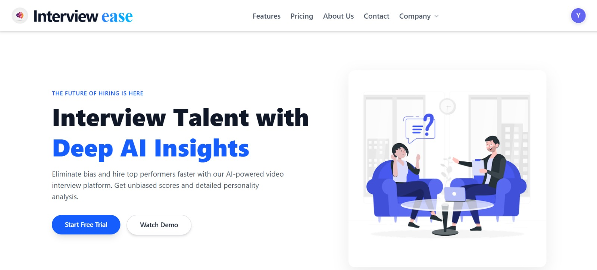
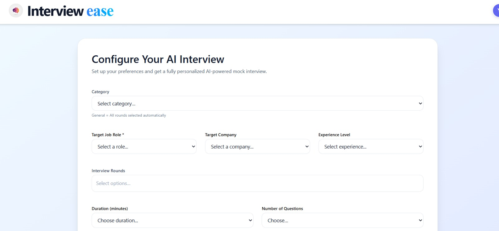
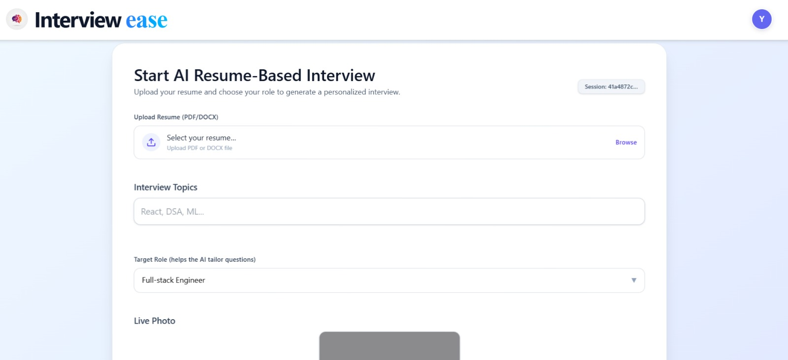
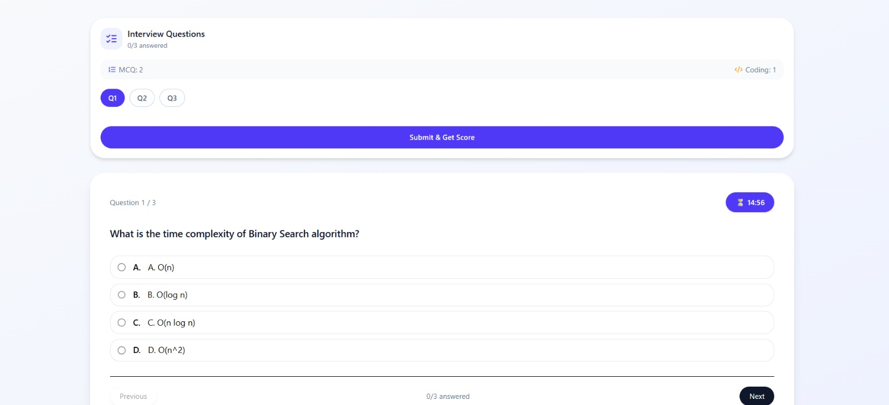
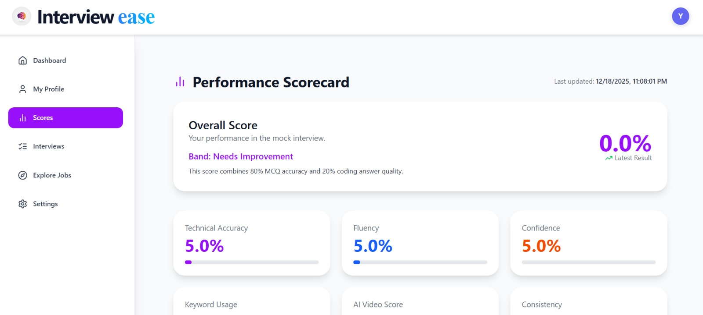
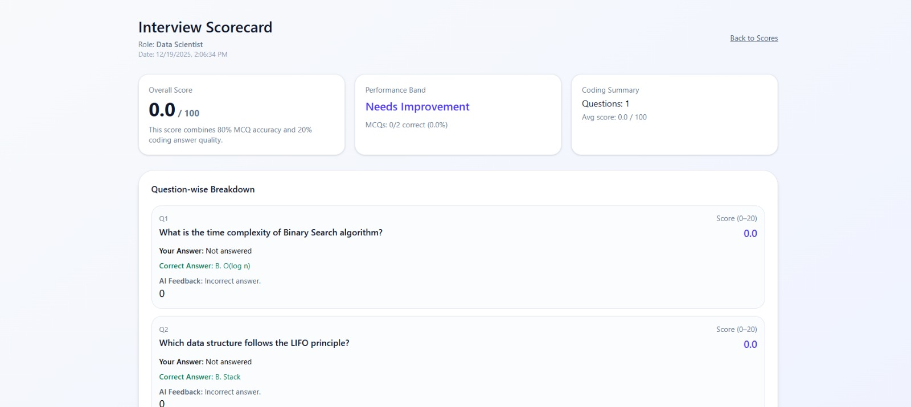
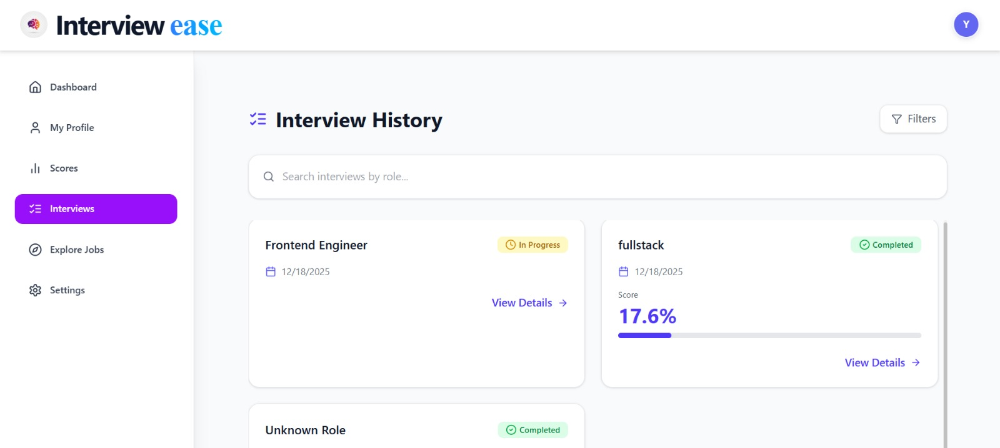
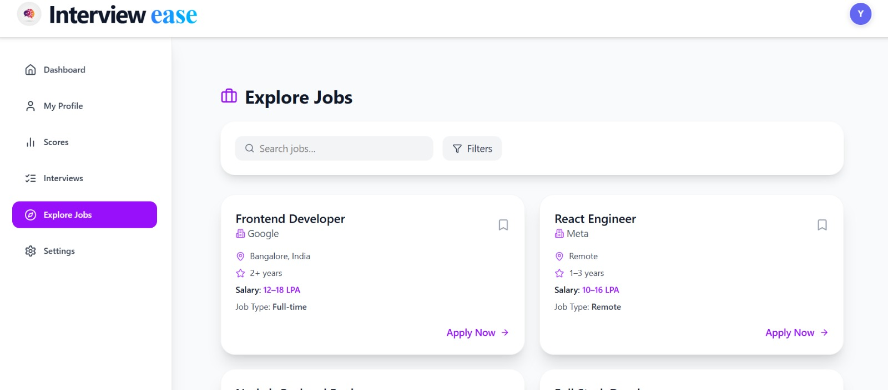

# Interview Ease

> **AI-powered interview practice and assessment platform for personalized, role-focused preparation.**

Interview Ease is a full-stack web application built to make interview preparation more structured, personalized, and measurable. It allows candidates to configure mock interviews around a target role and preferences, practice technical questions and coding problems, use resume-based interview preparation, explore job opportunities, and review detailed performance feedback.

The project explores the practical use of **Artificial Intelligence, Natural Language Processing, automated assessment, and personalized interview workflows** in a single web platform.

---

## 🚀 Why Interview Ease?

Traditional interview preparation is often fragmented across question banks, coding platforms, job portals, and manual self-assessment. It can also be difficult for candidates to understand exactly where they are improving and where they still need work.

Interview Ease brings the preparation loop into one application:

```text
Configure
    ↓
Practice
    ↓
Answer
    ↓
Evaluate
    ↓
Review Feedback
    ↓
Identify Weaknesses
    ↓
Improve
    ↓
Practice Again
```

The project report and research material behind Interview Ease identify several challenges in conventional interview processes, including subjectivity, inconsistent evaluation, scalability limitations, limited structured feedback, and the difficulty of assessing multiple candidate dimensions together.

---

## ✨ Key Features

### 🎯 Personalized AI Interview Configuration

Candidates can configure an interview according to their preparation goals, including:

- Target job role
- Target company
- Experience level
- Interview rounds
- Interview duration
- Number of questions
- Difficulty level
- Preferred language
- Feedback style
- Preferred technology stack
- Interview focus areas
- Custom instructions for the AI

This allows the interview experience to be tailored instead of using the same fixed question set for every candidate.

---

### 📄 Resume-Based Interview Preparation

Candidates can upload a **PDF or DOCX resume** and provide:

- Interview topics
- Target role

The system can use this information to create a more role-oriented interview preparation flow.

---

### 🧠 Technical Interview Assessment

Interview sessions can contain multiple-choice technical questions covering concepts relevant to the selected interview.

The interview interface provides:

- Question navigation
- Answer tracking
- MCQ progress
- Coding-question count
- Interview timer
- Submission and scoring flow

---

### 💻 Coding Assessment

Interview Ease supports coding questions as part of the interview experience, allowing candidates to demonstrate practical problem-solving ability alongside theoretical knowledge.

---

### 📊 Detailed Performance Scorecards

After an interview, candidates can review structured results including:

- Overall score
- Performance band
- Technical accuracy
- Fluency
- Confidence
- Communication-related performance
- Coding performance
- Question-wise results
- AI-generated feedback

The question-wise breakdown makes it easier to understand **why a result was received**, rather than relying only on one overall number.

---

### 📈 Dashboard & Progress Tracking

The dashboard provides a consolidated view of interview performance and preparation progress.

It can include:

- Overall performance
- Communication score
- Technical score
- Interview history
- Personalized improvement suggestions

---

### 🕘 Interview History

Previous interview sessions can be reviewed through a searchable history interface containing information such as:

- Target role
- Interview date
- Completion status
- Score
- Detailed result access

This makes repeated practice and progress comparison easier.

---

### 💼 Explore Jobs

The platform also provides a job-exploration interface where candidates can search and filter job listings.

Job cards can present:

- Job role
- Company
- Location
- Experience requirement
- Salary information
- Job type
- Application action

---

### 👤 Profile & Account Security

Candidates can manage profile information and account security through the settings area.

The application also uses authenticated access for protected user functionality.

---

## 🧩 Core Application Flow

```text
                         ┌──────────────────────┐
                         │       Candidate      │
                         └──────────┬───────────┘
                                    │
                                    ▼
                         ┌──────────────────────┐
                         │ Configure Interview  │
                         │ Role • Topics •      │
                         │ Difficulty • Duration│
                         └──────────┬───────────┘
                                    │
                     ┌──────────────┴──────────────┐
                     │                             │
                     ▼                             ▼
             ┌────────────────┐          ┌──────────────────┐
             │ Standard Mock  │          │ Resume-Based     │
             │ Interview      │          │ Interview        │
             └───────┬────────┘          └────────┬─────────┘
                     │                            │
                     └──────────────┬─────────────┘
                                    ▼
                         ┌──────────────────────┐
                         │ Interview Session    │
                         │ MCQs + Coding + AI   │
                         └──────────┬───────────┘
                                    │
                                    ▼
                         ┌──────────────────────┐
                         │ Evaluation & Scoring  │
                         └──────────┬───────────┘
                                    │
                                    ▼
                         ┌──────────────────────┐
                         │ Performance Scorecard │
                         │ Scores + Feedback     │
                         └──────────┬───────────┘
                                    │
                                    ▼
                         ┌──────────────────────┐
                         │ History + Dashboard  │
                         │ + Suggestions        │
                         └──────────────────────┘
```

---

## 🖥️ Application Screenshots

> **Note:** The screenshots below are intended to be stored in `docs/screenshots/`. The personal-information Settings screenshot is intentionally excluded.

### Landing Page

The landing page introduces the Interview Ease platform and its AI-assisted interview experience.



---

### Dashboard

The dashboard summarizes interview performance, technical and communication scores, interview history, and improvement suggestions.


---

### Interview Configuration

Candidates can configure the interview using role, company, experience, rounds, duration, question count, difficulty, language, technology stack, focus areas, and custom AI instructions.



---

### Resume-Based Interview

Candidates can upload a PDF/DOCX resume, provide interview topics, and select a target role for a more personalized preparation session.



---

### Interview Session

The interview interface provides question navigation, progress tracking, timing, MCQs, and coding-question support.



---

### Performance Scorecard

The performance dashboard presents overall performance together with multiple evaluation dimensions.



---

### Detailed Interview Results

Question-wise results provide the question, submitted answer, expected answer, score, and feedback.



---

### Interview History

Candidates can review previous interview attempts, completion status, scores, and detailed results.



---

### Explore Jobs

The job-exploration interface provides searchable job cards with role, company, location, experience, salary, and job type.



---

## 🏗️ Architecture

The current application follows a web application architecture with a React-based frontend and Node.js/Express backend, supported by database, authentication, AI, email, media, and payment-related services.

```text
┌──────────────────────────────────────────────────────────────┐
│                         FRONTEND                             │
│                 React Web Application                       │
│      UI • Routing • Forms • Interview Experience            │
└────────────────────────────┬─────────────────────────────────┘
                             │
                             │ HTTP / API
                             ▼
┌──────────────────────────────────────────────────────────────┐
│                         BACKEND                              │
│                    Node.js + Express                         │
│                                                              │
│ Authentication • Interview Logic • Scoring • User Data      │
│ Resume Processing • Job Features • Payment Service           │
└───────────────┬──────────────┬───────────────┬───────────────┘
                │              │               │
                ▼              ▼               ▼
          ┌──────────┐   ┌────────────┐   ┌──────────────┐
          │ MongoDB  │   │ AI Service │   │ Cloudinary   │
          │ Database │   │ / AI APIs  │   │ Media        │
          └──────────┘   └────────────┘   └──────────────┘
                │
                ├──────────────► Email Service
                │
                └──────────────► Payment Service
```

The accompanying research/report material describes a broader cloud-native multimodal architecture involving LLMs, speech processing, computer vision, microservices, message queues, caching, and cloud orchestration. Those research-stage architectural elements should not be interpreted as a claim that every component is part of the current public repository.

---

## 🛠️ Technology Stack

### Frontend

- React
- JavaScript
- Vite
- React Router
- Axios
- Material UI / component-based UI
- CSS

### Backend

- Node.js
- Express.js
- MongoDB
- Mongoose
- JWT authentication
- Bcrypt-based password handling
- Nodemailer
- Multer
- Cloudinary integration

### AI / Intelligent Features

The application uses AI services for interview-related generation and evaluation workflows.

The project documentation discusses:

- Large Language Models
- Natural Language Processing
- Dynamic question generation
- Automated response evaluation
- Resume-based personalization
- AI-generated feedback

### Development & Version Control

- npm
- Git
- GitHub
- VS Code

### External Services / Integrations

Depending on the configured environment, the project can integrate with services for:

- AI model/API access
- MongoDB database hosting
- Email delivery
- Cloud media storage
- Payment-related development flows

---

## 🔐 Security & Configuration

Security was treated as an important part of preparing the project for public source-code hosting.

The application uses environment-based configuration for sensitive values rather than keeping credentials directly in source code.

Important practices include:

- `.env` based secret management
- `.env` exclusion through `.gitignore`
- JWT-based authentication
- Server-side handling of API credentials
- Removal of hardcoded secret fallbacks
- Environment-variable based configuration
- Separation of payment functionality through a service layer

### Environment Variables

Create a local `.env` file inside the backend directory.

Example structure:

```env
MONGO_URL=your_mongodb_connection_string
GROQ_API_KEY=your_groq_api_key
JWT_SECRET=your_jwt_secret
FRONTEND_URL=http://localhost:5173
NODE_API_BASE=http://localhost:8000

EMAIL_USER=your_email
EMAIL_PASS=your_email_app_password

CLOUDINARY_CLOUD_NAME=your_cloud_name
CLOUDINARY_API_KEY=your_cloudinary_api_key
CLOUDINARY_API_SECRET=your_cloudinary_api_secret

SECRET_KEY=your_application_secret
```

**Never commit real credentials, API keys, passwords, database connection strings, or `.env` files to GitHub.**

---

## 💳 Payment Development Mode

The project includes a payment-service abstraction for development/testing.

A simulator can be used to exercise payment-related application flows without relying on live payment credentials during local development.

This keeps payment-related logic separated from the main application flow and makes testing safer and easier.

---

## 📂 Project Structure

The repository is organized around the frontend application and backend services.

```text
Interview-Ease-/
├── Backend/
├── aiInterview/
├── .gitignore
└── README.md
```

`Backend/` contains the Node.js/Express server and backend services.  
`aiInterview/` contains the React frontend application.

---

## ⚙️ Getting Started

### Prerequisites

Install:

- [Node.js](https://nodejs.org/)
- npm
- MongoDB
- Git

You will also need the external API/service credentials required by the application.

### 1. Clone the Repository

```bash
git clone <YOUR_GITHUB_REPOSITORY_URL>
cd Interview-Ease-
```

### 2. Install Backend Dependencies

```bash
cd Backend
npm install
```

### 3. Configure Environment Variables

Create:

```text
Backend/.env
```

Add the required environment variables using the example above.

Do not use real credentials in this README.

### 4. Start the Backend

```bash
npm run dev
```

The development backend is configured to run on:

```text
http://localhost:8000
```

### 5. Install Frontend Dependencies

Open another terminal:

```bash
cd aiInterview
npm install
```

### 6. Start the Frontend

Run the frontend development command defined in `aiInterview/package.json`.

Start the frontend using the development script defined in `aiInterview/package.json`:

```bash
npm run dev
```

Open the local frontend URL displayed by the terminal.

---

## 📊 Assessment Model

The application's scorecard is designed to give candidates more than a single overall result.

The visible application can present multiple dimensions such as:

```text
                 Interview Result
                       │
          ┌────────────┼────────────┐
          ▼            ▼            ▼
      Technical     Fluency     Confidence
          │            │            │
          └────────────┼────────────┘
                       ▼
                 Overall Result
                       │
                       ▼
                AI Feedback
                       │
                       ▼
              Improvement Areas
```

The research material additionally describes a broader multi-dimensional scoring approach and bias-aware evaluation framework. Those concepts provide the research foundation of the project, while the README focuses on the functionality represented by the application.

---

## 🧠 AI & Research Context

Interview Ease explores the use of AI in interview preparation and automated candidate assessment.

The accompanying research work discusses:

- Role-specific question generation
- Resume-aware interview personalization
- Natural Language Processing
- Speech analysis
- Computer vision
- Multimodal candidate assessment
- Automated scoring
- Bias mitigation
- Explainable feedback
- Candidate experience
- Scalable interview systems

The research material describes an experimental evaluation involving **52 candidates** and reports results including:

| Metric | Reported Result |
|---|---:|
| Correlation with expert evaluation | 89.7% |
| Evaluation-time reduction | 66.7% |
| Cost per interview reduction | 83.2% |
| Evaluation consistency improvement | 41.1% |
| Weighted average demographic-bias reduction | 93.9% |
| Scalability improvement | 900% |
| Candidate satisfaction improvement | 21.8% |
| Recruiter SUS score | 88.5 / 100 |

These values are **reported in the accompanying research/report material** and should be understood as research results rather than guarantees of performance for every deployment of the public application.

---

## 🔬 Research & Documentation

The project is accompanied by academic documentation covering:

- Project requirements and objectives
- System architecture
- Database and API design
- AI methodology
- Speech-processing concepts
- Computer-vision concepts
- Bias-mitigation methodology
- Experimental evaluation
- Results and discussion
- Future research directions

A related research paper is titled:

> **InterviewEase: A Smart AI Interviewing System for Role-Specific Technical, Behavioral, and Coding Assessment**

Research publication:

> International Journal of Creative and Open Research in Engineering and Management (IJCOPE), Volume 02, Issue 04, 2026.

DOI:

`10.55041/ijcope.v2i4.788`

---

## 🚧 Limitations & Future Improvements

Potential future improvements include:

- More advanced conversational interview interactions
- Expanded behavioral interview assessment
- Improved coding evaluation
- More detailed candidate analytics
- Broader job-data integrations
- Enhanced multilingual support
- More advanced resume-to-interview personalization
- Improved real-time interview analysis
- Expanded recruiter workflows
- Stronger explainability and fairness monitoring

The research documentation also identifies longer-term directions such as improved emotional-intelligence assessment, cross-cultural validation, longitudinal job-performance studies, learning-system integration, and broader multimodal analysis.

---

## 🎯 Project Goals

Interview Ease is designed around four central goals:

1. **Personalization** — adapt interview practice to the candidate and target role.
2. **Structured Assessment** — provide consistent question and scoring workflows.
3. **Actionable Feedback** — help candidates identify specific weaknesses.
4. **Accessible Practice** — make repeated interview preparation easier and more convenient.

---

## 📚 References

The research foundation draws on work covering:

- AI-assisted recruitment
- Automated interviewing
- Human evaluation bias
- Machine-learning fairness
- Natural Language Processing
- Multimodal AI
- AI ethics in hiring

For the complete bibliography, see the accompanying research paper and project documentation.

---

## ⚠️ Disclaimer

Interview Ease is an academic/software project for interview preparation and experimentation with AI-assisted assessment.

AI-generated scores and feedback should be treated as **practice guidance**, not as a definitive measurement of a candidate's professional ability or as an automated replacement for responsible human decision-making in real-world hiring.

---

## ⭐ Interview Ease

**Prepare smarter. Practice consistently. Understand your performance. Improve with every interview.**
